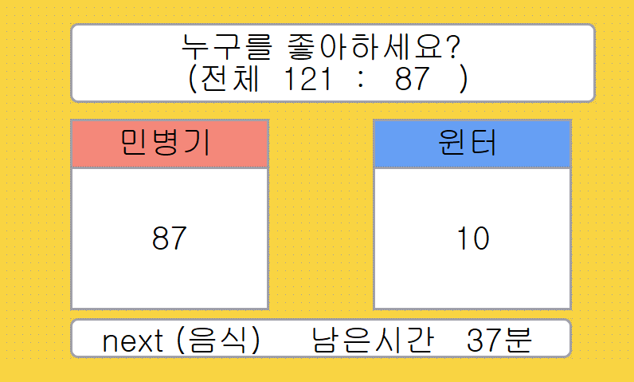
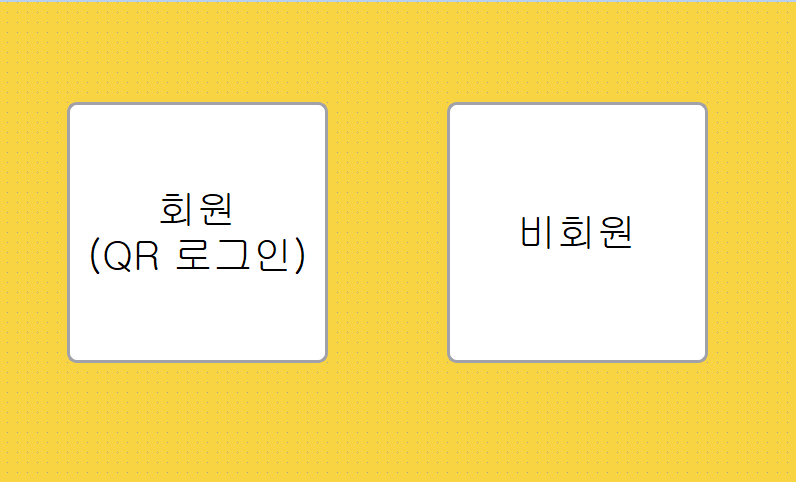
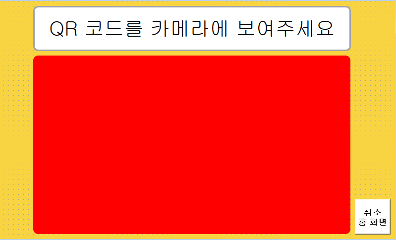

IoT 개발일지 : [Notion 바로가기](https://www.notion.so/IoT-e29952826b8d40109c43df9535a8a29f)

IoT 개발일지(캘린더) : [Notion 바로가기](https://www.notion.so/a6628cc8b91e49d4b20436359460649b?v=666a9c96619a469e9f1ffdf13c047b39&pvs=11)

# 목차
- 프로젝트 소개
    - UX
    - 프로세스 로직
    - 기술 스택
    - 개발 환경
    - 개발 기간
- 맡은 역할
- 개선사항, 문제 해결
- 소감
- 결론 및 향후 계획


# 프로젝트( IoT ) 소개
## UX
1. 사용자는 main 화면을 보고 투표 주제와 컨텐츠를 확인합니다
2. 원하는 항목에 꽁초를 집어넣음으로써 투표를 하고 member 화면으로 전환됩니다
3. 사용자는 camera 화면에서 qr 코드를 통해 로그인하고, 비회원의 경우 익명으로 투표를 합니다
4. 투표가 마무리되면 main화면으로 돌아갑니다

## 프로세스 로직
    
### 사용자는 main 화면을 보고 투표 주제와 컨텐츠를 확인합니다


  -  주제 표시 알고리즘  (qt_display/question_follow_web) 을 통해 뽑힌 주제가 화면에 표시됩니다.
  -  화면에 표시되는 주제는 1시간을 기준으로 변합니다

### 원하는 항목에 꽁초를 집어넣어 투표합니다
  - 초음파센서를 통해 측정한 거리로 answer을 판단하고 송신할 인스턴스(qt_display/msgDTO)에 저장합니다

### 회원, 비회원을 선택합니다


  - 버튼 클릭시 해당되는 다음 화면으로 전환됩니다
### 사용자는 카메라 화면에서 qr코드를 통해 로그인합니다


  - qt_display/qr_recog에서 openCV, pyzbar을 통해 추출한 값을 정규표현식을 통해 유저 id로 정제합니다
  - user_id를 송신할 인스턴스에 저장합니다
  - qr_signal을 통해 qt_display/ggong2_telecom/ggong2_mqtt.py의 publish_message 함수를 호출합니다.
  - cameraExitSignal을 통해 카메라 쓰레드와 위젯을 종료합니다
### 비회원의 경우 익명으로 투표를 합니다
  - 비회원 버튼 클릭시 송신할 인스턴스의 user_id를 1로 갱신합니다
  - anonymous_signal을 통해 qt_display/ggong2_telecom/ggong2_mqtt.py의 publish_message 함수를 호출합니다.
### 메인 화면으로 돌아갑니다
  - msgDTO의 인스턴스를 qt_display/ggong2_telecom/ggong2_mqtt.py의 publish_message 함수를 통해 토픽에 게시합니다
  - msgDTO의 인스턴스를 같은 파일의 insertmessage를 통해 DB에 저장합니다
  - vote와 point table에 row를 insert하고 등급을 갱신합니다. 일련의 과정은 트랜잭션으로 처리합니다

## 기술 스택
- Python
- QT
- openCV
- pandas
- mysql
- MQTT5
- AWS SQS
- AWS Lambda

## 개발 환경
- Windows 10
- Raspberry Pi 4

## 개발 기간
- 2023.07.26 ~ 2023.08.18

# 맡은 역할
- 김동현 : IoT 개발 및 H/W, U/X 설계

# 개선사항, 문제 해결

## MQTT5(AWS IoT) 적용에서의 인증
```
Connection failed with exception: AWS_ERROR_MQTT5_CONNACK_CONNECTION_REFUSED: Remote endpoint rejected the CONNECT attempt by returning an unsuccessful CONNACK
```
(오류 메시지)
- AWS SDK의 샘플코드를 참고하여 Qthread 안에 MQTT  기능을 구현하였습니다. 샘플 코드는 커맨드라인에서 입력을 받고 파싱하였지만, 본 프로젝트에서는 인스턴스에 저장된 값을 사용하기에 수정하였습니다. 이 과정에서 에러가 계속해서 발생하여 코드를 계속해서 찾아보았지만, 도저히 잘못된 부분을 찾을 수 없었습니다. 
- 하지만 샘플 코드를 그대로 다시 돌려보면 정상적으로 AWS IOT에서 구독한 메시지를 수신하여 당황하였습니다.
- CONNACK이라는 단어가 생소하여 찾아보았습니다.  MQTT에서 사용하는 Fixed header와 Variable header와 Payload로 이루어진 메시지이며, Variable header의 비트를 통해 에러코드를 리턴한다는 것을 알게 되었습니다.
- 코드를 처음부터 계속 비교해보며 발행하는 토픽이 다르다는 점을 발견하였습니다. 이 점을 중심으로 점검하니 AWS IoT를 사용할 경우 인증서를 통한 인증 외에도 토픽 역시 정책을 통해 허용된 상태여야 했습니다.
- AWS IoT의 정책을 수정하고 테스트하니 기기와 AWS IoT가 정상적으로 연결되고 메시지를 송수신 할 수 있었습니다.

## 메인 화면에서 Member 모달로 전환될 때 중복된 모달이 계속해서 생성
- 기기의 초음파 센서가 물체를 감지하면 회원, 비회원을 선택하고 다음 프로세스로 넘어가기 위해 Member 화면이 보여야 하지만, 이 Member 모달이 중복되어 생성하는 오류가 발생하였습니다.
- 초음파 센서가 물체를 딱 한번 감지한다는 보장이 없으며, 오히려 0.1초나 특정 시간 간격을 두어도 두 번 이상 감지할 수도 있기 때문에 이미 모달이 생성된 경우 중복되어 생성되지 않도록 해야 했습니다.
- 싱글톤 패턴이 하나의 인스턴스를 보장하며 QT에서 모달을 Class를 통해 생성하기 때문에 딱 문제상황을 해결하는데 알맞다고 생각되었고, 이를 적용하여 중복된 모달이 생성되지 아니하게 하였습니다.

## 시그널이 많아지고, 개발 중 IoT 기능의 추가로 디렉토리 구조의 변화가 자주 발생하였습니다
- 시그널을 생성하는 위치와 슬롯과 연결하기 위해 참조하는 위치가 다양해지면서 별도의 폴더에서 관리할 필요성을 느끼고 ggong2_signals 디렉토리에 파일을 정리하고 관리하였습니다.

## 시그널의 매개변수를 이용한 데이터 전달에서 객체 인스턴스로 변경
- 초기 프로젝트 설계 단계에서 IoT 기기는 user_no와 answer 두 가지 주요 데이터만을 처리하였습니다. 때문에, 별도의 클래스나 구조를 설계하지 않고 Qt의 시그널 매개변수를 통해 데이터를 직접 전달하는 방식으로 구현하였습니다.
- 그러나 프로젝트의 요구 사항이 변화하면서 IoT 기기가 직접 데이터베이스에 데이터를 삽입해야 하는 새로운 상황이 발생하였습니다. 디렉토리 구조가 복잡해지고 전달 과정이 늘어났으며, 관리할 데이터도 많아지면서 시그널을 통해 전달되는 데이터의 크기도 커지고 과정도 복잡해지는 문제가 발생하였습니다.
- 복잡해진 프로세스를 풀어내기 위해, 데이터를 객체 인스턴스로 관리하였습니다. 덕분에 데이터의 무결성과 코드의 가독성이 크게 향상되었습니다.

## database error 1364
- 도중에 팀원의 실수로 DB가 삭제되는 이슈가 발생하였습니다
- 해당 팀원이 DB를 복구하였지만, 이후 포인트 테이블에 db를 삽입할 경우 1364 에러가 발생하였습니다.
- 당시 저와 다른 팀원은 각자 집에서 IoT와 클라우드 서버, 프론트의 연결 테스트를 진행중이었습니다.
- 해당 사실을 모른 상태로 스프링 서버와 연결 테스트 중 JPA의 문제인지, 도대체 왜 null값이 발생하는지 원인을 찾기 위해 팀원과 머리를 맞대고 고민하다 SQL을 수정하고, JPA도 수정해보고 서버 시간도 확인해보고 다양한 시도를 해 본 끝에 번뜩 auto increment 특성을 다시 부여하여 해결하였습니다.

## ec2의 스프링 서버와 질문 순서가 맞지 않는 오류
- 현재 표시되는 질문을 산출하는 방식이 클라우드 서버와 맞지 않았습니다.
- 1시간마다 바뀌는 질문은 바뀔때마다 서버에서 송신하지 않고 질문 pool에서 같은 산출 알고리즘으로 한 시간에 하나씩 질문을 뽑아내도록 하고 있었습니다.
- 클라우드 서버의 코드를 보고 이와 동일하도록 IoT 코드를 수정하여 같은 질문이 화면에 표시되도록 수정하였습니다.

# AWS SQS를 이용한 메시지 순서
- MQTT 통신은 중간에 메시지가 유실될 수 있으며 실제 서비스를 가정하고 다수의 기기를 고려하면 DB에 삽입이 완료되기 전에 다른 메시지를 수신할 수 있기 때문에, AWS SQS를 이용하여 메시지를 큐에 저장하고 DB에 삽입하는 방식을 고안하였습니다.
- FIFO queue를 사용하면 메세지의 순서도 보장할 수 있으며 이미 AWS IoT를 사용하고 있었기 때문에 손쉽게 적용 가능한 점이 매력적이었습니다.
- 본 프로젝트에서 실제로는 하나의 기기를 사용하여 테스트를 진행하며, SQS와 Lamda는 비용이 발생하는 등 지속적인 테스트에 걸림돌이 있어 시연에는 적용하지 않았습니다.

# 소감
### 개요
아쉬움이 많은 프로젝트였습니다.

### 기획
<details>
<summary>
기획 단계에서 고려하지 못한 부분들을 꼼꼼하게 살피고</summary> <pre> 

1. IoT 변경사항
데이터를 가공하고 삽입하는 기능이 프로젝트 중간에 IoT에 추가되어
코드의 전체 구조를 변경하였습니다.


2. 초음파 센서의 한계
초음파센서 1개만으로 20cm, 40cm 전방 일직선에 들어오는 물체를
카운팅을 하고자 하였지만,
부채꼴 형태의 센서 범위로 인해 정확하게 위치시키기 어려웠습니다.

이를 고려해서 데이터를 고려하고 디렉토리 구조를 설계하였다면
많은 시간을 아끼고 다른 부분의 완성도를 더 높일 수 있었으며

초음파 센서를 한개 더 구매했다면 카운팅 정확도를 더 올릴 수 있었을 텐데 하는 아쉬움이 남습니다.
</pre>
</details>
각 작업들의 소요시간을 더욱 정확하게 파악했다면<br>
시간을 아끼고 다른 부분에 집중해서<br>
결과물의 완성도가 더 높아졌을 것이기에,<br>
다음 프로젝트에서는 더 꼼꼼히 준비하고 기획해야겠다는 아쉬움이 남습니다.

전체 프로세스를 완벽히 이해하고 있는지가 기획에 얼마나 큰 영향을 끼치는지 체감하였습니다.<br>
 

### JIRA
    JIRA를 처음 사용해보면서 기대감이 많았습니다.
    실제로 스프린트를 만들고 피드백하면서 잘 사용할 경우 정말 좋은 협업 툴이라는 생각이 들었습니다.
    하지만  본 프로젝트에서는 사용해본 적 없는 기술 스택을 학습하고 처음 사용하는 경우가 많아
    예상 소요 시간 산정과 task 분배가 정확하지 못한 경우가 대부분이었습니다.
    JIRA를 제대로 활용하지 못했다는 생각이 들었고
    
    학습 및 작업 시간 예측의 중요성을 절감하였습니다.
    협업 툴은 단순히 도구 자체의 기능뿐만 아니라
    팀원들 간의 의사소통과 task에 대한 이해도가
    중요한 부분을 차지한다고 생각하였습니다.
    다가오는 프로젝트에서는 이번의 경험을 바탕으로 더욱 신중하게 작업 분배와 계획을 세우고,
    이를 통해 JIRA를 충분히 활용하고자 합니다.
    
# 결론 및 향후 계획
## 결론
    본 프로젝트를 진행하면서 초기의 기획단계에서 구상한 내용과 다른, 많은 추가적인 변동사항들이 있었습니다.
    이를 적용하고, 해결해나가면서 많은 부분을 배울 수 있었고 더 공부해보고 싶은 방향도 찾았습니다.
    AWS IoT와 Qthread, 실시간 데이터 처리를 사용하면서 어떻게 하면 팀원들이 쉽게 이해할 수 있도록 
    디렉토리와 코드 구조를 설계할 수 있을지 많은 고민을 하였습니다.
    
    프로젝트 기획 단계에서 더 노력을 했다면 중간에 변동사항이 줄어들고, 시간을 아낄 수 있지 않았을까 하는 생각과
    JIRA의 활용에 대한 아쉬움이 남습니다.
## 향후 계획
### 학습 
- 클린코드와 디자인 패턴에 대해서 깊게 학습할 예정입니다. 동료들이 더 쉽게 이해할 수 있는 코드를 만들고 싶습니다
- AWS SQS외에도 RabbitMQ와 Kafka를 비롯한 메시지 큐를 학습하고 사용해볼 예정입니다


# 마지막까지 읽어주셔서 감사합니다, 좋은 하루 되세요 :)
